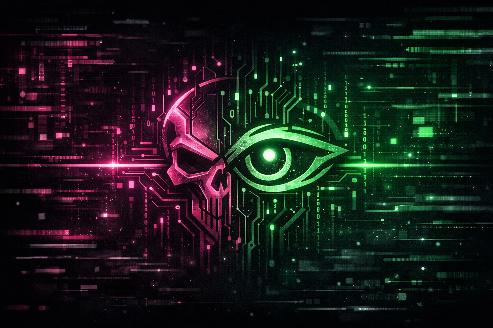

# █ █████████ [SYSTEM INITIALIZED] █████████ █

<!-- Typing Animation Header - Web Developer Theme -->

---

## 🖧 IDENTITY: DIGITAL ARCHITECT | ABOUT ME

I am **Younis Dany**, a dedicated **Full Stack Web Developer** focused on creating seamless, high-performance digital solutions. I bridge the gap between aesthetic design and robust functionality, ensuring every project is both beautiful and scalable.

> **Motto**: "Crafting the future, one line of code at a time."

---

## ⚙️ ARSENAL: DEVELOPMENT TOOLS | MY TECH STACK

My comprehensive toolkit allows me to manage projects from concept to deployment, specializing in modern web standards and efficient backend systems.

### Languages & Frameworks | Core Protocols

  

### Utilities & Platforms | Deployment Environment

  

---

## 📈 PROJECT LOGS | GITHUB STATS

A record of my development journey and contributions to the digital landscape.

<!-- GitHub Stats Card - Using 'Dracula' theme for a dark, mysterious look -->

<!-- Top Languages Card - Dracula Theme -->

<!-- GitHub Streak Stats - Dracula Theme -->

<!-- GitHub Activity Graph - Dracula Theme -->

<!-- GitHub Trophy Card - Dark Theme -->

---

## 📂 FEATURED PROJECTS | DIGITAL CREATIONS

Showcasing my capability in delivering functional and elegant web solutions.

| Project Name | Primary Technologies | Focus |
| :---: | :---: | :---: |
| **Attendance System** | `PHP`, `MySQL` | **[BACKEND]** - High-precision time-tracking solution. |
| **Permissions System** | `JavaScript`, `PHP` | **[FULL STACK]** - Multi-level access control architecture. |
| **Animated Landing Pages** | `GSAP`, `CSS3` | **[FRONTEND]** - High-impact visual data delivery. |

---

## 📡 CONNECTIVITY CHANNELS | GET IN TOUCH

Let's collaborate on your next digital project.

  

<!-- Dynamic Quote Card - Web Dev Quote -->

---

## 👁️ VISITOR LOG | LIVE WIDGETS

<!-- Visitor Counter - Dark Theme -->

<!-- GitHub Snake Animation (Animated Image) - Dark Theme -->

<!-- Footer Wave - Cyber/Hacker Colors -->

